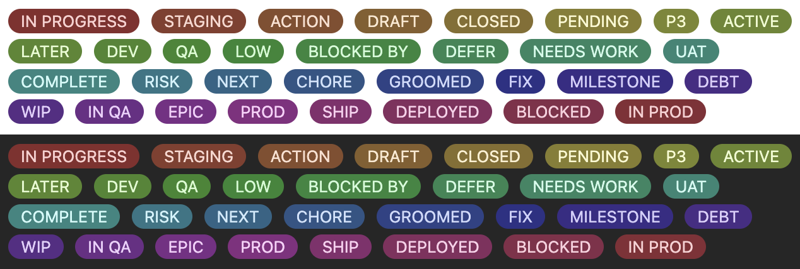

# Inline Pills

An [Obsidian](https://obsidian.md) plugin that renders `{{label}}` syntax as styled inline pill elements in your notes.



## Usage

Wrap any text in double curly braces and it will be rendered as a coloured pill:

```
Status: {{In Progress}}  {{Blocked}}  {{Done}}
```

Each label is assigned a colour deterministically from its text, so the same label always renders with the same colour across all your notes.

Pills are rendered in both **Reading view** and **Live Preview** (editing) mode. In Live Preview, moving your cursor inside a `{{label}}` reveals the raw syntax for editing; moving away renders the pill again.

## Installation

### Manual

1. Download `main.js`, `manifest.json`, and `styles.css` from the [latest release](../../releases/latest).
2. Copy the files to `<Vault>/.obsidian/plugins/inline-pills/`.
3. Reload Obsidian and enable **Inline Pills** under **Settings → Community plugins**.

## Development

### Prerequisites

- Node.js v18+
- npm

### Setup

```bash
npm install
```

### Dev (watch mode)

```bash
npm run dev
```

This compiles `src/main.ts` to `main.js` and watches for changes. Since the repo lives directly in your vault's plugin folder, reload Obsidian to pick up changes.

### Production build

```bash
npm run build
```

### Lint

```bash
npm run lint
```

## Releasing

Releases are automated via GitHub Actions. When a tag is pushed, the workflow builds the plugin and creates a draft GitHub release with `main.js`, `manifest.json`, and `styles.css` attached.

1. Update `minAppVersion` in `manifest.json` if the release requires a newer Obsidian API.
2. Run `npm version patch` (or `minor` / `major`) — this updates the version in `manifest.json` and `versions.json` and creates a git tag.
3. Push the commit and the tag: `git push && git push --tags`
4. The GitHub Actions workflow will create a draft release — edit it to add release notes and publish.
